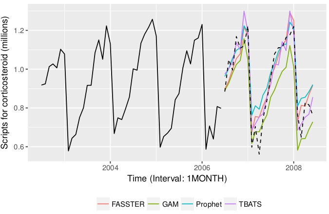
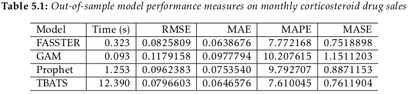
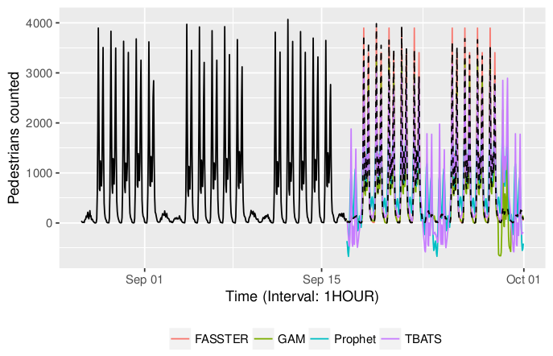
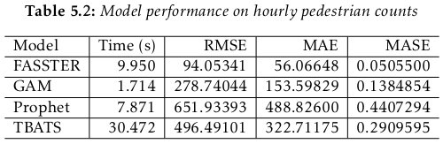
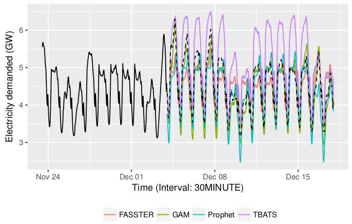
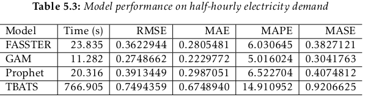

class: inverse

```{r setup, include=FALSE}
options(htmltools.dir.version = FALSE,
        width = 87)
library(tidyverse)
library(fasster)
library(knitr)
library(kableExtra)
library(lubridate)
library(tsibble)
library(ggplot2)
library(fontawesome)
library(htmltools)
library(gganimate)

opts_chunk$set(
  echo = FALSE, warning = FALSE, message = FALSE, comment = "#>",
  fig.path = 'figure/', cache.path = 'cache/', fig.align = 'center', 
  fig.width = 12, fig.show = 'hold',
  cache = TRUE, external = TRUE, dev = 'svglite', dev.args = list(bg = "transparent")
)

gif2mp4 <- function(gif, path){
  tmp_gif <- tempfile()
  magick::image_write(gif, tmp_gif)
  message("Converting gif to mp4...")
  system(paste0('ffmpeg -i ', tmp_gif, ' -y -movflags faststart -pix_fmt yuv420p -vf "scale=trunc(iw/2)*2:trunc(ih/2)*2" ',
                file.path(getwd(), normalizePath(path))))
  message("Done!")
}
mp4_vid <- function(src){
  HTML(
    paste0(
      '<video autoplay>
        <source src="', src, '" type="video/mp4">
      </video>'
    )
  )
}

theme_set(
  theme_grey(base_size = 16) + 
  theme(
    legend.position = "bottom",
    plot.background = element_rect(fill = "transparent"),
    legend.background = element_rect(fill = "transparent")
  )
)
```

.title[fasster]
.sticker-float[]

## Forecasting multiple seasonality with state switching

.bottom[
### Mitchell O'Hara-Wild (`r fa("twitter", fill="#1da1f2")`[@mitchoharawild](https://twitter.com/mitchoharawild))
<br>
### 13 July 2018

### Slides @ [www.mitchelloharawild.com/useR18/](https://www.mitchelloharawild.com/useR18/)
]

---
class: center

.animated.fadeIn[
## Time-series data is changing

### More data, more often.

<hr>
]

---
class: center

## Time-series data is changing

### More data, more often.

<hr>

.animated.fadeIn[
## Complicated patterns emerge

.pull-left[
### Multiple seasonality
### Lots of data
]
.pull-right[
### Missing values
### Additional noise
]

<hr> 
]

---
class: center

## Time-series data is changing

### More data, more often.

<hr>

## Complicated patterns emerge

.pull-left[
### Multiple seasonality
### Lots of data
]
.pull-right[
### Missing values
### Additional noise
]

<hr> 

.animated.fadeIn[
## New tools are needed
.sticker[]
.sticker[]
.sticker[]
]

---
class: inverse, center, top

background-image: url(resources/electricity.jpg)
background-size: cover

.animated.fadeIn.shadowText[
# Electricity demand
]

---

# Electricity demand (Monthly)
```{r elecMonthly_gen, eval = FALSE}
anim_points <- c("month", "day", "30 minutes")

make_frame <- function(unit){
  agg_elec <- tsibbledata::elecdemand %>% 
    index_by(Time = !!expr(floor_date(index, unit = !!unit))) %>%
    summarise(Demand = sum(Demand), x = median(index)) %>%
    mutate(unit = unit)
}

plot_data <- anim_points %>%
  map_dfr(make_frame)

p <- plot_data %>% 
  as_tibble %>%
  mutate(unit = factor(unit, levels = anim_points)) %>% 
  ggplot(aes(x=x, y=Demand)) + 
  geom_line() + 
  xlab("Time") + ylab("Electiricty Demand (GW)") +
  transition_states(unit, 10, 1, wrap = FALSE) + 
  ease_aes('cubic-out') + 
  view_follow(fixed_x = TRUE)

gif1 <- animate(p, device = "png", width = 1000, height = 600)

gif1_split <- split_animation(gif1, cut(gganimate::frame_vars(gif1)$frame, c(0, 3, 51, 100)))

gif1_split[[1]] %>% 
  gif2mp4("resources/anim1.mp4")
```
```{r elecMonthly}
mp4_vid("resources/anim1.mp4")
```


---

# Electricity demand (Daily)
```{r elecDaily_gen, eval = FALSE}
gif1_split[[2]] %>% 
  gif2mp4("resources/anim2.mp4")
```
```{r elecDaily}
mp4_vid("resources/anim2.mp4")
```

---

# Electricity demand (Half-hourly)
```{r elecPlot_gen, eval = FALSE}
gif1_split[[3]] %>% 
  gif2mp4("resources/anim3.mp4")
```
```{r elecPlot}
mp4_vid("resources/anim3.mp4")
```
---

# Electricity demand (Half-hourly)
```{r elecPlotZoom_gen, eval = FALSE}
yrange <- c(tsibbledata::elecdemand %>%
  .$Demand %>% range,
  tsibbledata::elecdemand %>%
  filter(month(index) == 6) %>%
  .$Demand %>% range
)

xrange <- c(tsibbledata::elecdemand %>%
              .$index %>% range,
            tsibbledata::elecdemand %>%
              filter(month(index) == 6) %>%
              .$index %>% range
)

p2 <- tsibbledata::elecdemand %>% 
  autoplot(Demand) + 
  xlab("Time") + ylab("Electiricty Demand (GW)") +
  view_step_manual(1,10, 
                   c(xrange[1],xrange[c(1,3)]), 
                   c(xrange[2],xrange[c(2,4)]),
                   c(1000, yrange[c(1,3)]),
                   c(1001, yrange[c(2,4)]),
                   wrap = FALSE)
gif2 <- animate(p2, device = "png", width = 1000, height = 600)
gif2_split <- split_animation(gif2, cut(gganimate::frame_vars(gif2)$frame, c(0, 31, 70, 100)))
gif2_split[[2]] %>% 
  gif2mp4("resources/anim4.mp4")
```

```{r elecPlotZoom}
mp4_vid("resources/anim4.mp4")
```
---


# Models for multiple seasonality
```{r, cache = TRUE}
library(timevis)
data <- data.frame(
  id      = 1:6,
  content = c("MSARIMA", "DSHW", "TBATS",
              "MLR", "GAM", "Prophet"),
  start   = c("1970", "2003", "2010",
              "???", "1990", "2017"),
  group   = rep(c("ss", "reg"), each = 3),
  end     = rep(NA, 6)
)

grp <- data.frame(
  id = c("ss", "reg"),
  content = rep(c("State Space", "Regression"))
)

timevis(data, grp, showZoom = FALSE, options = list(zoomable=FALSE, showCurrentTime=FALSE), width = "100%", height = "250px")
```

<table class="table">
  <thead>
    <tr>
      <th>Model</th>
      <th>Flexible</th>
      <th>Speed</th>
      <th>Exogenous Regressors</th>
      <th>Accuracy</th>
      <th>Decompose Components</th>
      <th>Evolving Terms</th>
    </tr>
  </thead>
  <tbody>
    <tr>
      <td>State&nbspSpace</td>
      <td class="danger">No</td>
      <td class="danger">Slow</td>
      <td class="warning">Depends</td>
      <td class="warning">Okay</td>
      <td class="success">Yes</td>
      <td class="success">Yes</td>
    </tr>
    <tr>
      <td>Regression</td>
      <td class="success">Yes</td>
      <td class="success">Fast</td>
      <td class="success">Yes</td>
      <td class="warning">Okay</td>
      <td class="warning">Depends</td>
      <td class="danger">No</td>
    </tr>
  </tbody>
</table>

.center[(this table is a *massive* generalisation)]

---
class: inverse

.sticker-float[]
# What is fasster?

### * **F**orecasting with **A**dditive **S**witching of **S**easonality, **T**rend & **E**xogenous **R**egressors*

<br>

--

### A state space model that is:
.pull-left[
* ### Flexible
]
.pull-right[
* ### Fast
]

<br>

--

### With support for:

.pull-left[
* ### Missing values
]
.pull-right[
* ### Exogenous regressors
]

---

.sticker-float[]

# Extending fable

**fasster** is the first extension of fable.

<br>

This allows fasster models to work with other features from the fable package.

* Consistent output and graphics
* Usable in combination forecasts

<br>

Uses formula based model specification:

.panel.panel-default[.panel-body.largecode[
t(y) ~ *\{specials\}*
]]

---

# Supported specials for fasster

```{r}
tribble(
  ~ Function, ~ Description,
  "poly(n)", "Polynomials",
  "seas(s)", "Seasonal factors",
  "trig(s, q)", "Seasonal fourier terms",
  "ARMA(ar, ma)", "ARMA processes",
  "xreg", "Exogenous regressors",
  "custom()", "Custom dlm matrices",
  "%S%", "State switching"
) %>% 
  kable(format = "html") %>%
  kableExtra::kable_styling(font_size = 26)
```

---

# Modelling with fasster

```{r elecPlot2, cache = TRUE}
tsibbledata::elecdemand %>%  
  rename(Time = index) %>%
  autoplot(Demand) + 
  ylab("Electricity Demand (GW)")
```

---

# Modelling with fasster

```{r electr, echo = TRUE, cache = TRUE}
elec_tr <- tsibbledata::elecdemand %>%
  filter(index < ymd("2014-03-01"))
```
```{r electr-print}
elec_tr
```


---

# Capturing seasonality
```{r, echo = TRUE, eval = FALSE}
Demand ~ poly(1) + trig(48, 16)
```


```{r noswitching, cache = TRUE}
tsibbledata::elecdemand %>% 
  filter(month(index) == 6) %>%
  ggplot(aes(x=index, y = Demand)) +
  geom_line() + 
  xlab("Time [30 MINUTES]") + 
  ylab("Electricity Demand (GW)")
```


---

# Capturing seasonality
```{r, echo = TRUE, eval = FALSE}
Demand ~ DayType %S% (poly(1) + trig(48, 16))
```


```{r switching, cache = TRUE}
tsibbledata::elecdemand %>% 
  filter(month(index) == 6) %>%
  mutate(
    `Working Day` = ifelse(WorkDay == 1, Demand, NA),
    `Non-working Day` = ifelse(WorkDay == 0, Demand, NA)
  ) %>%
  gather("Day Type", "Demand", `Working Day`, `Non-working Day`) %>%
  ggplot(aes(x=index, y = Demand, colour = `Day Type`)) +
  geom_line() + 
  xlab("Time [30 MINUTES]") + 
  ylab("Electricity Demand (GW)") + 
  scale_colour_brewer(palette = "Dark2")
```

---

# Using temperature information

```{r, echo = TRUE, eval = FALSE}
Demand ~ Temperature + I(Temperature^2)
# (huge simplification of the non-linear relationship)
```

```{r fig.height=5}
elec_tr %>%
  gather("Series", "Value", Demand, Temperature) %>%
  ggplot(aes(x=index, y=Value, group=Series)) +
  geom_line() +
  facet_grid(Series ~ ., scales = "free_y") + 
  ylab("Electricity Demand (GW)") + 
  xlab("Date") + 
  ggtitle("Electricity demanded and temperature")
```

* Strongly related non-linear relationship.
* Takes care of most annual seasonality.

---

# Estimating the model

```{r, elecfit, echo = TRUE, cache = TRUE}
elec_fit <- elec_tr %>%
  fasster(
    log(Demand) ~ 
      WorkDay %S% (trig(48, 16) + poly(1)) + 
      Temperature + I(Temperature^2)
  )
```

```{r elecfitout, echo = FALSE}
elec_fit
```

<br>

* A log transformation is taken to stabalise the variance.
* Specials are combined additively.

---

# Components

```{r elec-comp, echo = TRUE, cache = TRUE}
components(elec_fit)
```

---

# Components (Seasonality)

```{r comp-plot1, cache = FALSE}
fit_comp <- components(elec_fit)
fit_comp %>%
  select(index, `WorkDay_0/trig(48, 16)`, `WorkDay_1/trig(48, 16)`) %>% 
  gather("Term", "Value", -index) %>%
  ggplot(aes(x = hour(index) + minute(index)/60, y = Value, colour = Term, group = interaction(Term, date(index)))) + 
  geom_line() + 
  xlab("Hour") + 
  scale_colour_brewer(palette = "Dark2")
```


---

# Forecasts

```{r}
elec_ts <- tsibbledata::elecdemand %>%
  tsibble::filter(
    index >= ymd("2014-03-01"),
    index < ymd("2014-03-15"))
```

```{r elecfc, cache = TRUE, echo = TRUE}
elec_fc <- elec_fit %>% 
  forecast(newdata = elec_ts)
```
```{r elecfcout, echo = FALSE}
elec_fc
```

--

```{r, echo = TRUE, eval = FALSE}
elec_ts
```

```{r}
elec_ts %>%
  select(-Demand) %>%
  print(n=6)
```

---

# Forecasts

```{r elecfcplot, echo = FALSE}
elec_fc %>%
  autoplot(level = NULL) +
  ylab("Electricity Demand (GW)")
```

---

# Forecasts
```{r elecfcplotint, echo = FALSE}
autoplot(tail(elec_tr, 48*7*2)) + 
  autolayer(elec_fc) +
  ylab("Electricity Demand (GW)")
```
---

# Forecasts
```{r elecfcplotintactual, echo = FALSE}
autoplot(tail(elec_tr, 48*7*2)) + 
  autolayer(elec_fc) + 
  geom_line(aes(x=index, y=Demand), data=elec_ts) +
  ylab("Electricity Demand (GW)")
```

---
 
# Interpolation 
 
```{r elecmissing} 
elecdemand_missing <- elec_tr 
elecdemand_missing$Demand[elecdemand_missing$index >= ymd("2014-02-01") & 
                          elecdemand_missing$index <  ymd("2014-02-14")] <- NA 
 
elecdemand_missing %>%   
  rename(Time = index) %>% 
  autoplot(Demand) +  
  ylab("Electricity Demand (GW)") 
``` 
```{r, echo = TRUE}
elec_misfit <- elecdemand_missing %>% 
  fasster(log(Demand) ~ WorkDay %S% (trig(48, 16) + poly(1)) +  
                        Temperature + Temperature^2)
```

---

# Interpolation 
```{r interpolated}
elecdemand_missing %>% 
  fasster(log(Demand) ~ WorkDay %S% (trig(48, 16) + poly(1)) +  
                        Temperature + Temperature^2) %>% 
  interpolate %>% 
  autoplot(Demand) +
  ylab("Electricity Demand (GW)")
``` 
```{r, echo = TRUE, eval = FALSE}
elec_misfit %>%
  interpolate
```


---

# Streaming data

```{r stream_data_blank}
elec_tr %>% 
  autoplot(Demand) + 
  xlim(c(min(elec_tr$index), max(tail(elec_ts, -48*7)$index))) +
  ylab("Electricity Demand (GW)")
```

---

# Streaming data

```{r stream_data_new}
elec_tr %>% 
  autoplot(Demand) + 
  geom_line(aes(x = index, y = Demand), data = head(elec_ts, 48*7), colour = "#1b9e77") + 
  xlim(c(min(elec_tr$index), max(tail(elec_ts, -48*7)$index))) +
  ylab("Electricity Demand (GW)")
```

```{r echo = TRUE, eval = FALSE}
elec_stream
```

---

# Streaming data

```{r stream_fc}
elec_fit %>%
  stream(head(elec_ts, 48*7)) %>%
  forecast(tail(elec_ts, -48*7)) %>%
  autoplot(level = NULL) + 
  ylab("Electricity Demand (GW)") + 
  xlim(c(min(elec_tr$index), max(tail(elec_ts, -48*7)$index)))
```

```{r echo = TRUE, eval = FALSE}
elec_fit %>%
  stream(elec_stream) %>%
  forecast(newdata = elec_stream_future)
```

---
class: inverse, top

.sticker-float[]

.title[Summary]

.larger[
Features:
.pull-left[
* Component extraction
* Forecasting
]
.pull-right[
* Interpolation
* Streaming
]
]

<br>

--

<table class="table">
  <thead>
    <tr>
      <th>Model</th>
      <th>Flexible</th>
      <th>Speed</th>
      <th>Exogenous Regressors</th>
      <th>Accuracy</th>
      <th>Decompose Components</th>
      <th>Evolving Terms</th>
    </tr>
  </thead>
  <tbody>
    <tr>
      <td>TBATS</td>
      <td class="danger">No</td>
      <td class="danger">Slow</td>
      <td class="danger">No</td>
      <td class="warning">Okay</td>
      <td class="success">Yes</td>
      <td class="success">Yes</td>
    </tr>
    <tr>
      <td>Prophet</td>
      <td class="warning">Okay</td>
      <td class="warning">Okay</td>
      <td class="success">Yes</td>
      <td class="success">Good</td>
      <td class="success">Yes</td>
      <td class="danger">No</td>
    </tr>
    <tr>
      <td>fasster</td>
      <td class="success">Yes</td>
      <td class="warning">Okay</td>
      <td class="success">Yes</td>
      <td class="success">Good</td>
      <td class="success">Yes</td>
      <td class="success">Yes</td>
    </tr>
  </tbody>
</table>

---

class: inverse, top

.sticker-float[]

.title[Thanks! `r fa("comments", fill = "white")`]

<br>

.larger[
`r fa("github", fill = "white")` Learn more on GitHub: [tidyverts/fasster](https://github.com/tidyverts/fasster)

`r fa("chart-line", fill = "white")` Keep updated: [tidyverts.org](http://www.tidyverts.org)

`r fa("desktop", fill = "white")` Review slides: [www.mitchelloharawild.com/useR18/](https://www.mitchelloharawild.com/useR18/)

<br>

This work is licensed as `r fa("creative-commons", fill="white")` BY-NC 4.0.
]

---
class: center

## Corticosteroid drug sales
.thesisplot[

]


---
class: center

## Pedestrian counts
.thesisplot[

]


---
class: center

## Electricity demand
.thesisplot[

]

